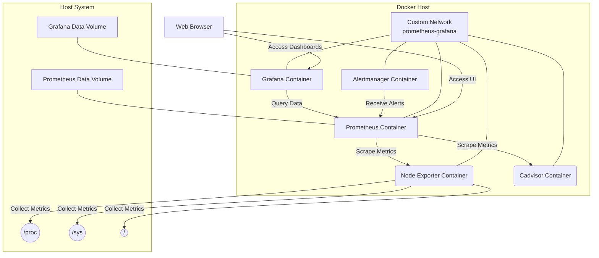
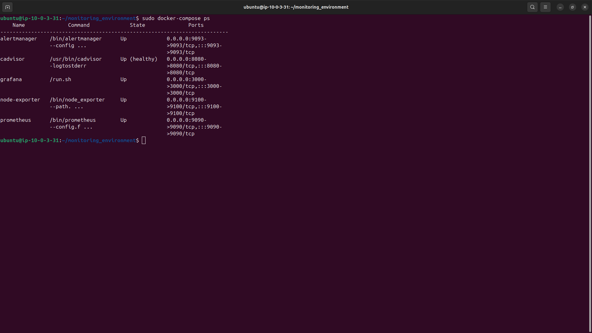
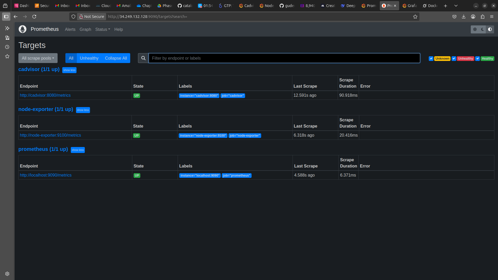
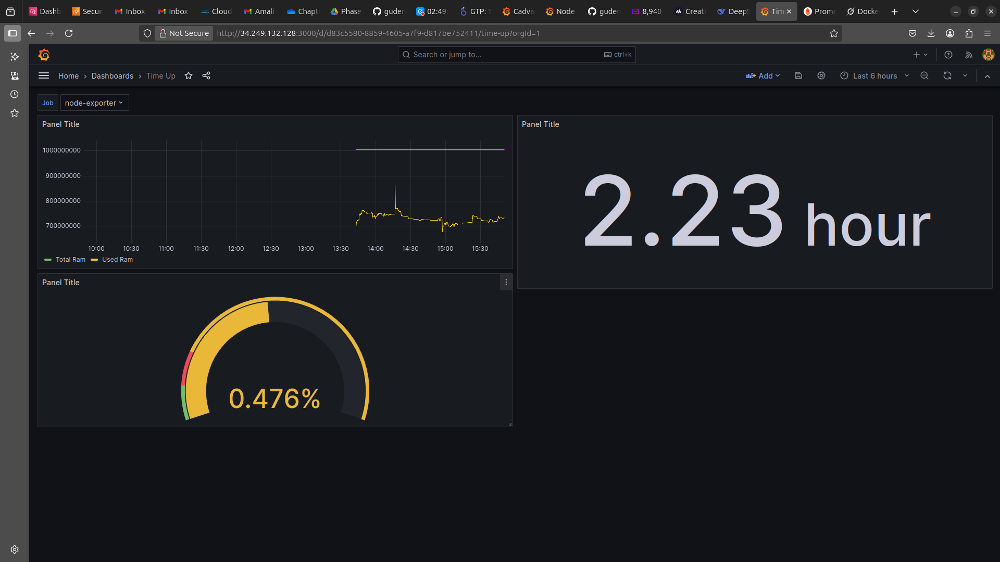
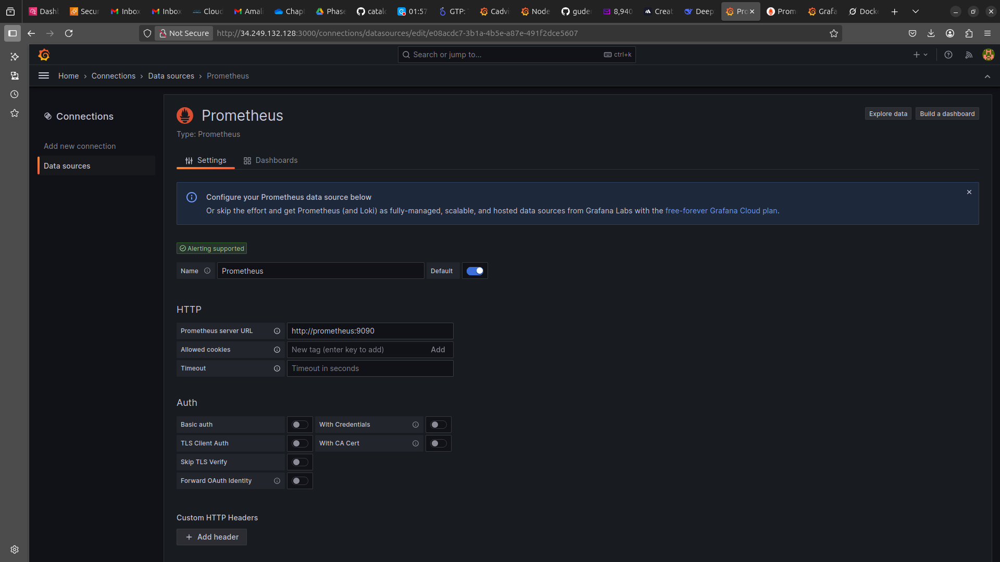
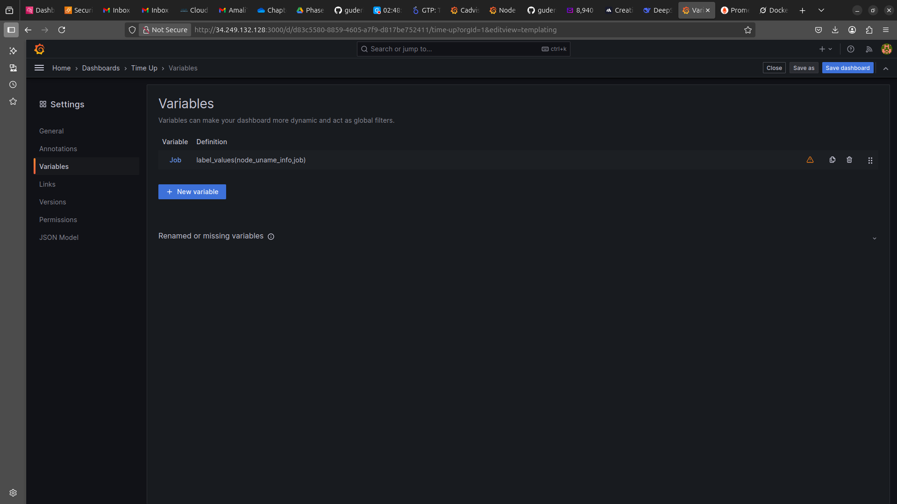

# Monitoring Project Documentation

## Overview
This project sets up a modern monitoring solution using **Prometheus** and **Grafana** to monitor a server running multiple Docker containers and the host operating system. Metrics from the host (CPU, memory, disk) and containers (resource usage, health) are collected, visualized in Grafana dashboards, and monitored with alerting mechanisms via Alertmanager. The setup uses Docker Compose to manage services, ensuring easy deployment and scalability.

### Imported Node Exporter Dashboard View


# Prometheus & Grafana Monitoring Environment

## Table of Contents
- [Architecture Overview](#architecture-overview)
- [Setup Instructions](#setup-instructions)
- [Assessment Questions & Answers](#assessment-questions--answers)
- [Screenshots](#screenshots)
- [Configuration Files](#configuration-files)

## Architecture Overview



## Setup Instructions

### Prerequisites
- Docker Engine 20.10+
- Docker Compose 2.12+
- 4GB RAM minimum
- 2 CPU cores minimum

### Installation Steps
1. Clone the repository:
   ```bash
   git clone https://github.com/guderian120/monitoring_environment.git
   cd monitoring_environment
   ```

2. Start the monitoring stack:
   ```bash
   docker compose up -d
   ```

3. Access the services:
   - Prometheus: http://localhost:9090
   - Grafana: http://localhost:3000 (admin/admin)
   - Node Exporter: http://localhost:9100/metrics
   - cAdvisor: http://localhost:8080/metrics

4. Configure Grafana:
   - Add Prometheus data source: http://prometheus:9090
   - Import dashboards from `grafana/dashboards/`

## Assessment Questions & Answers

### Section 1: Architecture and Setup Understanding

#### Question 1: Container Orchestration Analysis
the Node Exporter needs those host mounts (/proc, /sys, /) typically because it should be able to access the host's actual system files to get real metrics. Like /proc has all the process  and kernel info, "/sys" has device details, and "/" gives filesystem access. If I didn't mount these, the container would just see its own environment, which is not what we want in this case. Without these mounts, we will lose visibility into CPu usage, memory stats, disk space and basically everything important. 
this setup shows how containerized monitoring should work, we keep the monitoring agent separate from apps, but give it just enough access to do its job. And we make the mounts read-only where possible for security. Pretty elegant and simple solution actually.

#### Question 2: Network Security Implications
That custom network "prometheus-grafana" is a better choice over the default Docker network. It not only isolates our monitoring environment from other environments which is good security practice but also ensures our host ports remain closed while giving containers ability to communicate with each other.The port exposure is a security risk ports 3000 and 9093 was the only opened port on my host, because the containers could access resources from each other in the prometheus-network. I tried to configure a reverse proxy such that we can at least have encryption in transit, however the time afforded for the task wasn't sufficient enough

If I was setting this up for real, I'd:
  Put everything behind a reverse proxy like Nginx
  Add proper authentication (maybe OAuth)
  encrypt the traffic with TLS for sure. The current setup is fine for lab but way too open for production.

#### Question 3: Data Persistence Strategy
Looking at the compose file, Prometheus uses a named volume for its data directory while Grafana has its own volume for configs.This is great because they have different needs, Prometheus is handling alot of time-series writes while Grafana is storing dashboard configs mostly. 

If you removed these volumes? all your historical metrics will be destroyed for Prometheus. For Grafana you willd lose all your dashboards and settings. 

### Section 2: Metrics and Query Understanding

#### Question 4: PromQL Logic Breakdown
That uptime query `node_time_seconds - node_boot_time_seconds` is very interesting. `node_boot_time_seconds` is when the system last started, `node_time_seconds` is current time. Subtract them and you get seconds since boot. 

But it's not perfect because if the system clock drifts or gets adjusted, your uptime calculation could be wrong.

I might use `time() - node_boot_time_seconds` instead sometimes. It uses Prometheus server time which is usually more reliable, especially if you have multiple servers in different timezones. But both have their uses depending on what exactly you need.

#### Question 5: Memory Metrics Deep Dive
The Reasone why `MemTotal - MemAvailable` is used instead of `MemFree`  is because "free" memory in Linux isn't exactly free memory. The system uses spare memory for caching and buffers, which it can free up when needed.

`MemAvailable` includes that reclaimable memory, so it gives a truer picture of actual available memory. If you just look at `MemFree`, you might think  memory is almost full when really there's plenty available in caches. This way we avoid false alerts during heavy operations.

#### Question 6: Filesystem Query Analysis
the filesystem query `1 - (node_filesystem_avail_bytes / node_filesystem_size_bytes)` is calculating used percentage by taking the available fraction and subtracting from 1. Simple but effective for root mount.

Problem is if you have multiple mounts it'll return multiple values which could juggle up your dashboard. Also it might include temp filesystems like tmpfs 

I'll modify it by adding a filter like `fstype!="tmpfs"` and maybe aggregate with `avg()` if I want a single value. 

### Section 3: Visualization and Dashboard Design

#### Question 7: Visualization Type Justification
For the uptime display, I used a Stat panel - because it's a single number I want to see at a glance. Time series for CPU was right choice cause you need to see how it changes over time. The Gauge for disk usage is perfect as it shows how close you are to limits.


#### Question 8: Threshold Configuration Strategy
The 80% disk threshold is standard, gives you warning before things get critical. But in production scenarions it depends so much on the system. Like for a database server I will  set lower threshold maybe 70% because they fill up fast and performance disrupts when disks get full.

A better approach would be tiered alerts:
- 80% = warning notification
- 90% = critical alert to admins
- 95% = page the on-call engineer

Also I will consider growth rate - if a disk is growing 10% per day, 80% is more urgent than if it's stable. I will implement this in Alertmanager with different severity levels and escalation paths.

#### Question 9: Dashboard Variable Implementation
The $job variable in Grafana is very useful, lets you filter dashboards uniquely by  their name. Behind the scenes it's basically a dropdown that inserts values into queries. When you have multiple values it runs the query for each combination.

But it can sometimes create challenges. Like if you have a variable with thousands of values, your dashboard might timeout trying to load all options. Or if you select incompatible variables the queries return no data. 


### Section 4: Production and Scalability Considerations

#### Question 10: Resource Planning for 100 Servers
typically for 100 servers we need to scale up significantly. From my testing each server generates about 1,000 metrics at 15s intervals. So that's 100 * 1000 = 100,000 metrics every 15 seconds - about 6,700 samples per second.

For storage, assuming 2.5 bytes per sample, that's about 16.5MB per minute or 24GB per day. For 30 days retention we'd need at least 720GB storage. 

CPU and memory"  Prometheus documentations suggest 4 cores and 16GB RAM for this load but I'd go higher to be safe. First bottleneck i believe will be disk I/O - SSDs are  must. 

#### Question 11: High Availability Design
For HIgh Availability I would run multiple Prometheus instances scraping the same targets - active/active setup. They will write to shared storage like S3 or a distributed filesystem. For Alertmanager I will run  two or 3 instances in a cluster so they can deduplicate alerts.

Grafana can be scaled horizontally since it's stateles, just put a load balancer in front. I will also ensure all instances use the same database backend.

The trade-off is complexity - managing this distributed system is way harder than a single node. But for production you need the reliability. Also costs compound with multiple instances and services

#### Question 12: Security Hardening Analysis
Biggest vulnerabilities I saw:
1. No authentication on Prometheus/Alertmanager
2. Plain HTTP
3. Containers running as root
4. Grafana with default admin password

How I can fix:
- Add authentication everywhere 
- Setup TLS for all communications
- Run containers as non-root users
- Use secrets management for credentials
- Enable Grafana security features

### Section 5: Troubleshooting and Operations

#### Question 13: Debugging DOWN Targets
When a target shows DOWN in Prometheus, here's how I troubleshoot:
First I check the Prometheus UI for error messages, this often tells you exactly what's wrong. Then I will `docker compose logs prometheus` to see if there's clues. 

Next I will try to curl the endpoint manually from the Prometheus container:
```bash
docker compose exec prometheus curl http://node-exporter:9100/metrics
```
If that fails, check DNS resolution with `nslookup node-exporter`. If DNS works but connection fails, might be firewall issue. 

Most common causes I've seen:
- Exporter service down (restart it)
- Network misconfiguration (check compose file)
- Firewall blocking (disable or open ports)
- Resource exhaustion (check container stats) with CAdvisor

#### Question 14: Performance Optimization
Some queries can be real resource hogs - anything with heavy aggregations or regex matching. Like the filesystem query with multiple mountpoints could be expensive at scale.

To optimize:
- Use recording rules for frequent queries
- Avoid unnecessary aggregations
- Set proper query time ranges
- Increase scrape intervals where possible

Also in Grafana:
- Use dashboard refresh intervals wisely
- Avoid querying huge time ranges
- Use template variables to limit scope

And monitor Prometheus itself, track its resource usage and query performance. 

#### Question 15: Capacity Planning Scenario
When Prometheus disk usage grows uncontrollably, first I check:
- Retention period (maybe set too long)
- Number of metrics being scraped
- Scrape interval too frequent

For retention policy, it depends on business needs, maybe 15 days for operational dashboards but 1 year for business metrics. 

I will implement data lifecycle management:
- Short-term high-res storage (30 days)
- Long-term downsampled storage (1 year)
- Archive cold data to object storage
- Automate cleanup of old data


## Screenshots

1. **Docker Containers Running**  
   

2. **Prometheus Targets Status**  
   

3. **Grafana Dashboard Panels**  
   

4. **Grafana Data Source Configuration**  
   

5. **Dashboard Variable Configuration**  
   

## Configuration Files

All configuration files are available in the repository:

- [Docker Compose](docker-compose.yml)
- [Prometheus Configuration](prometheus/prometheus.yml)
- [Alertmanager Configuration](alertmanager/alertmanager.yml)
- [Grafana Provisioning](grafana/provisioning/)